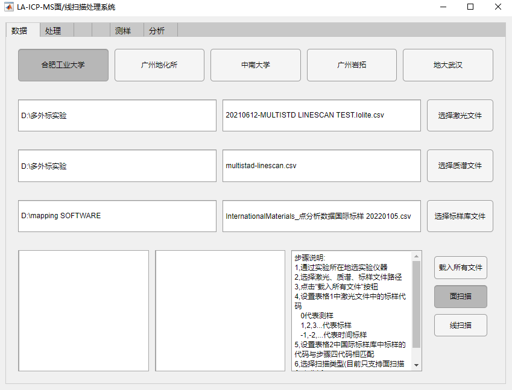

# LA-ICPMS ScanAnalysis

## 软件简介

 - 基于MATLAB
 - 多实验室支持性验证（中科院广州地化所、中南大学、广州拓岩、地大武汉等）
 - 支持更高的数据准确度和更高的空间分辨率
 - 支持多外标无内标计算方案
 - 支持灵活的成图、自定义计算、数据提取功能

## 环境要求

### 计算机配置

- 操作系统：Windows 7 及更高版本
- 处理器：Intel Core i7 4790k 或更高
- 内存：16G 或更高

### 依赖运行库

建议使用**MATLAB Runtime 2021a**或更高版本的Runtime运行`LA-ICPMS ScanAnalysis`

- 官方页面：[MATLAB Runtime](https://ww2.mathworks.cn/products/compiler/matlab-runtime.html)
- 2021a版下载：[MATLAB Runtime 2021a For Windows-64bit](https://ssd.mathworks.cn/supportfiles/downloads/R2021a/Release/8/deployment_files/installer/complete/win64/MATLAB_Runtime_R2021a_Update_8_win64.zip)

## 获取软件

!>实验结束后，请从实验室相关人员处获取`ScanAnalysis.exe`，也可直接联系葛璨或汪方跃老师获取

 - 软件下载：暂不提供
 - 标样库下载：[面扫描国际标样](https://doc.icee.ac.cn/mapping/srm/%E9%9D%A2%E6%89%AB%E6%8F%8F%E5%9B%BD%E9%99%85%E6%A0%87%E6%A0%B7_%E5%B8%A6NODA.csv)
