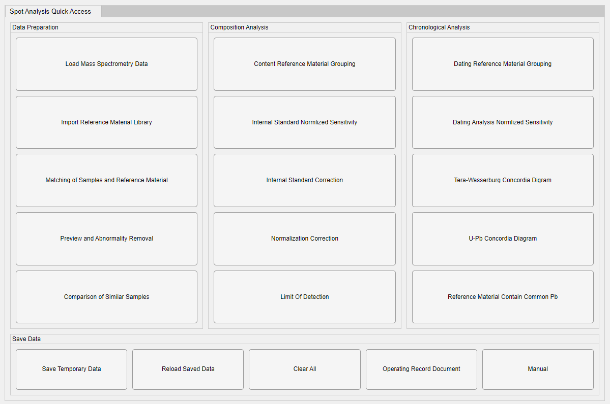
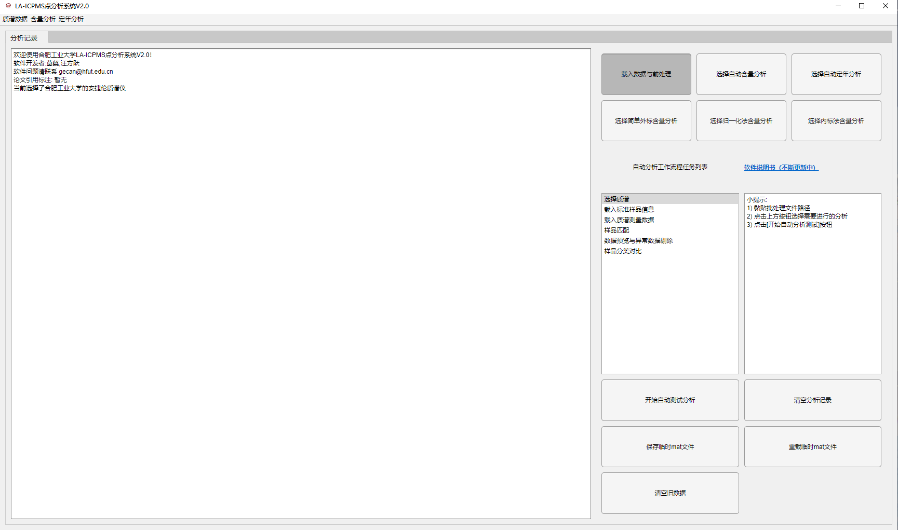

# LA-ICPMS SpotAnalysis

## 软件简介

### SpotAnalysis V4

### SpotAnalysis V2

 - 基于MATLAB
 - 适配安捷伦（Agilent）、赛默飞（Thermofisher）、耶拿（Analytik Jena）质谱仪数据格式
 - 多实验室支持性验证（中科院广州地化所、中南大学、广州拓岩等）
 - 支持灵活的时间截取、内外标校正功能

## 环境要求

### 计算机配置

 - 操作系统：Windows 7 及更高版本
 - 处理器：Intel Core i7 4790k 或更高
 - 内存：16G 或更高

### 依赖运行库

建议使用**MATLAB Runtime 2021a**或更高版本的Runtime运行`LA-ICPMS ScanAnalysis`

 - 官方页面：[MATLAB Runtime](https://ww2.mathworks.cn/products/compiler/matlab-runtime.html)
 - `2021a`版下载：[MATLAB Runtime 2021a For Windows-64bit](https://ssd.mathworks.cn/supportfiles/downloads/R2021a/Release/8/deployment_files/installer/complete/win64/MATLAB_Runtime_R2021a_Update_8_win64.zip)

## 获取软件

!>实验结束后，请从实验室相关人员处获取`SpotAnalysis.exe`，也可直接联系葛璨或汪方跃老师

 - 软件下载：暂不提供
 - 标样库：[点分析国际标样](/spot/srm/%E7%82%B9%E5%88%86%E6%9E%90%E5%9B%BD%E9%99%85%E6%A0%87%E6%A0%B720220719.xlsx)
