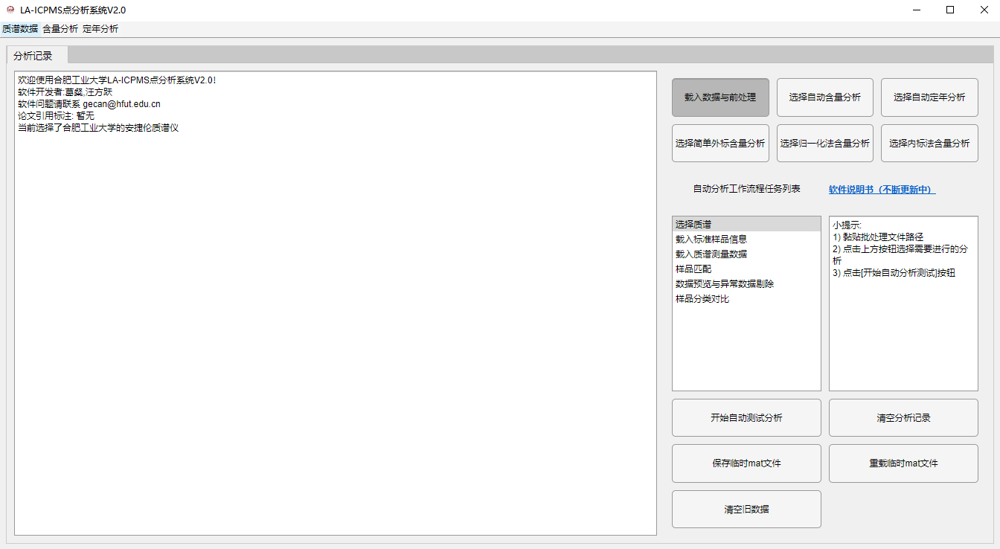

# LA-ICPMS SpotAnalysis

> **LA-ICPMS点分析系统2.0**
> 使用简介：https://note.youdao.com/s/ASHbY4Ya

## 环境要求

### 计算机配置

- 操作系统：Windows 7 及更高版本
- 处理器：Intel Core i7 4790k 或更高
- 内存：16G 或更高

### 依赖运行库

建议使用**MATLAB Runtime 2021a**或更高版本的Runtime运行LA-ICPMS ScanAnalysis

- 官方页面：[MATLAB Runtime](https://ww2.mathworks.cn/products/compiler/matlab-runtime.html)
- 2021a版下载：[MATLAB Runtime 2021a For Windows-64bit](https://ssd.mathworks.com/supportfiles/downloads/R2021a/Release/8/deployment_files/installer/complete/win64/MATLAB_Runtime_R2021a_Update_8_win64.zip)

## 获取软件

?>请从实验室相关人员处获取`SpotAnalysisV2.exe`，也可直接联系葛璨或汪方跃老师

### 标样库下载

- 下载链接：

## 更新日志

- 2023-04 文档测试