# SpotAnalysis 功能介绍

!>使用简介：https://note.youdao.com/s/ASHbY4Ya

## 软件结构

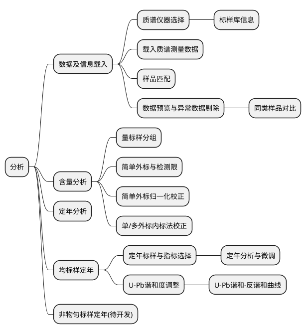
```plantuml
@startmindmap
* 分析
** 数据及信息载入
*** 质谱仪器选择
**** 标样库信息
*** 载入质谱测量数据
*** 样品匹配
*** 数据预览与异常数据剔除
**** 同类样品对比
** 含量分析
*** 量标样分组
*** 简单外标与检测限
*** 简单外标归一化校正
*** 单/多外标内标法校正
** 定年分析
** 均标样定年
*** 定年标样与指标选择
**** 定年分析与微调
*** U-Pb谐和度调整
**** U-Pb谐和-反谐和曲线
** 非物匀标样定年(待开发)
@endmindmap
```

## 目录跳转

!>可从此处快速前往您查找的内容

- [**0 启动页面**](/spot/intro?id=_0-启动页面)
- [**1.1 质谱仪器选择页面**](/spot/intro?id=_11-质谱仪器选择页面)
- [**1.2 标准样品库页面**](/spot/intro?id=_12-标准样品库页面)
- [**1.3 载入数据页面**](/spot/intro?id=_13-载入数据页面)
- [**1.4 样品匹配页面**](/spot/intro?id=_14-样品匹配页面)
- [**1.5 预览与异常剔除页面**](/spot/intro?id=_15-预览与异常剔除页面)
- [**1.6 分类预览页面**](/spot/intro?id=_16-分类预览页面)
- [**2.1 含量标样分组页面**](/spot/intro?id=_21-含量标样分组页面)
- [**2.2 简单外标法与检测限页面**](/spot/intro?id=_22-简单外标法与检测限页面)
- [**2.3 简单外标归一化校正页面**](/spot/intro?id=_23-简单外标归一化校正页面)
- [**2.4 单/多外标内标法校正页面**](/spot/intro?id=_24-单/多外标内标法校正页面)
- [**3.1 定年标样与指标选择页面**](/spot/intro?id=_31-定年标样与指标选择页面)
- [**3.2 定年分析和微调**](/spot/intro?id=_32-定年分析和微调)
- [**3.3 U-Pb谐和度调整**](/spot/intro?id=_33-U-Pb谐和度调整)
- [**3.4 U-Pb 谐和-反谐和曲线页面**](/spot/intro?id=_34-U-Pb谐和-反谐和曲线页面)

### 页面流程与关系

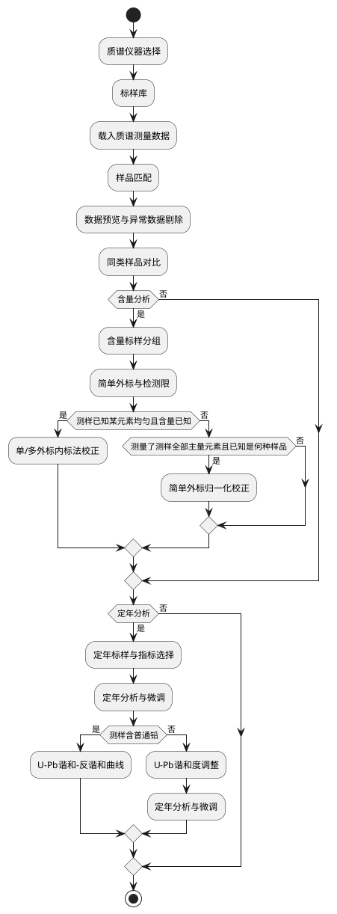
```plantuml
@startuml
start
:质谱仪器选择;
:标样库;
:载入质谱测量数据;
:样品匹配;
:数据预览与异常数据剔除;
:同类样品对比;
if (含量分析) then (是)
:含量标样分组;
:简单外标与检测限;
if (测样已知某元素均匀且含量已知) then (是)
:单/多外标内标法校正;
else (否)
if (测量了测样全部主量元素且已知是何种样品) then (是)
:简单外标归一化校正;
else (否)
endif 
endif  
else (否)
endif
if (定年分析) then (是)
:定年标样与指标选择;
:定年分析与微调;
if (测样含普通铅) then (是)
:U-Pb谐和-反谐和曲线;
else(否)
:U-Pb谐和度调整;
:定年分析与微调;
endif
else (否)
endif 
stop
@enduml
```

## 软件页面

### 0 启动页面

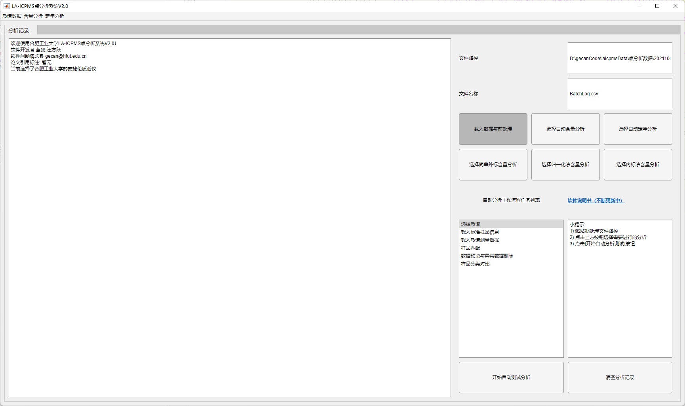

对常规的分析任务，黏贴Batch log.csv文件路径后，请点击选择自动定年分析按钮及含量分析的模式，点击开始自动测试分析即可开启全自动分析模式，右侧将显示处理过程中根据样品处理过程信息。自动分析流程如下:

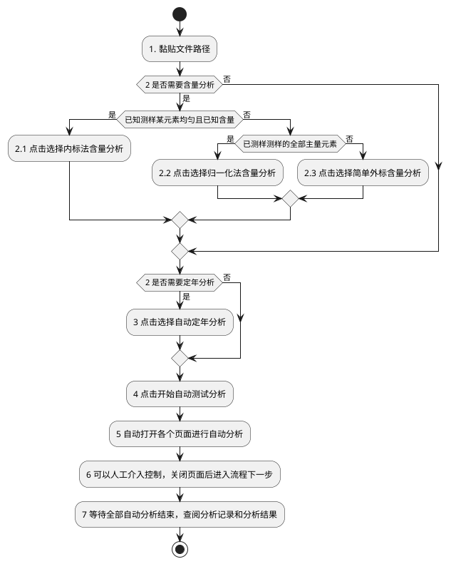
```plantuml
@startuml
start
:1. 黏贴文件路径;
if (2 是否需要含量分析) then (是)
if (已知测样某元素均匀且已知含量) then (是)
:2.1 点击选择内标法含量分析;
else(否)
if (已测样测样的全部主量元素) then (是)
:2.2 点击选择归一化法含量分析;
else(否)
:2.3 点击选择简单外标含量分析;
endif

endif
else (否)
endif
if (2 是否需要定年分析) then (是)
:3 点击选择自动定年分析;
else(否)
endif
:4 点击开始自动测试分析;
:5 自动打开各个页面进行自动分析;
:6 可以人工介入控制，关闭页面后进入流程下一步;
:7 等待全部自动分析结束，查阅分析记录和分析结果;
stop
@enduml
```

?>主要功能：选择相关选项后，右侧自动分析工作流程任务列表中会同时显示将要开展的任务流程，同时左侧的提示区会给出建议。开始自动测试分析后，自动分析工作流程列表中的任务将逐个执行，左侧将显示分析过程中的操作记录。

------------

### 1.1 质谱仪器选择页面

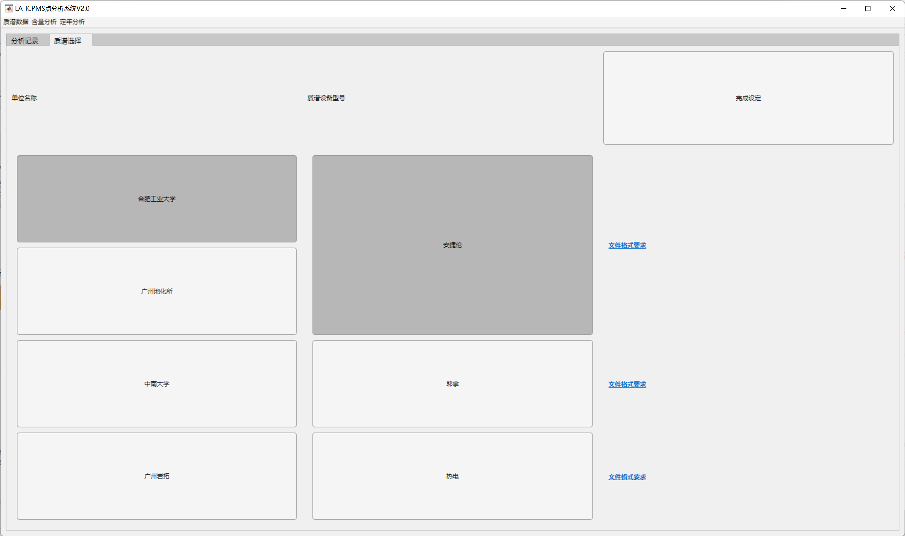

!>如果使用合肥工业大学纬地楼3楼安捷伦质谱，则不需要进入此步骤

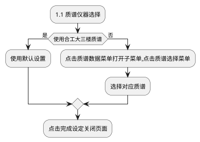
```plantuml
@startuml
:1.1 质谱仪器选择;
if (使用合工大三楼质谱) then (是)
:使用默认设置;
else (否)
:点击质谱数据菜单打开子菜单,点击质谱选择菜单;
:选择对应质谱;
endif
:点击完成设定关闭页面;
@enduml
```

------------

### 1.2 标准样品库页面

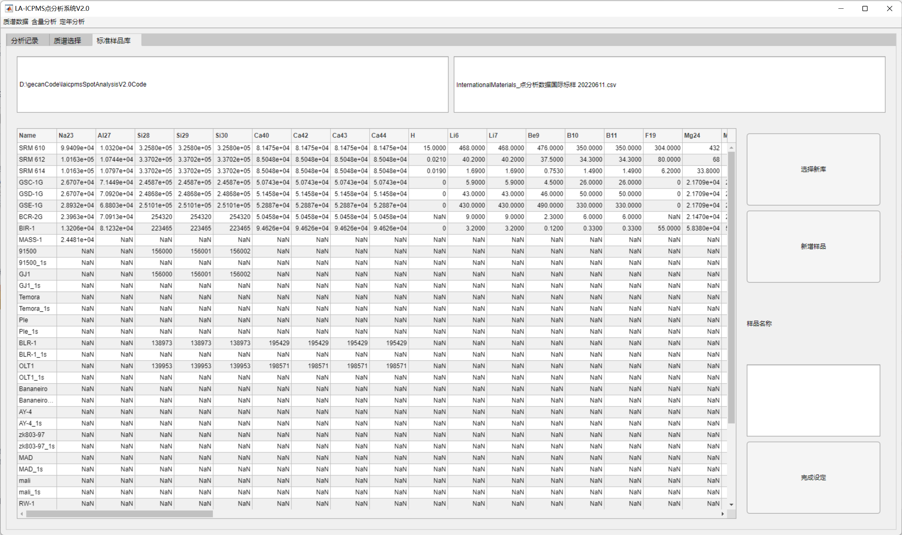

新增样品功能是用户交互式自定义新的标样，此功能尚未完成，如需要添加新标样，可以通过excel软件编辑标样文件完成

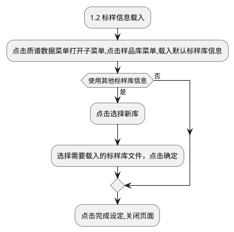
```plantuml
@startuml
:1.2 标样信息载入;
:点击质谱数据菜单打开子菜单,点击样品库菜单,载入默认标样库信息;
if (使用其他标样库信息) then (是)
:点击选择新库;
:选择需要载入的标样库文件，点击确定;
else (否)
endif
:点击完成设定,关闭页面;
@enduml
```

------------

### 1.3 载入数据页面

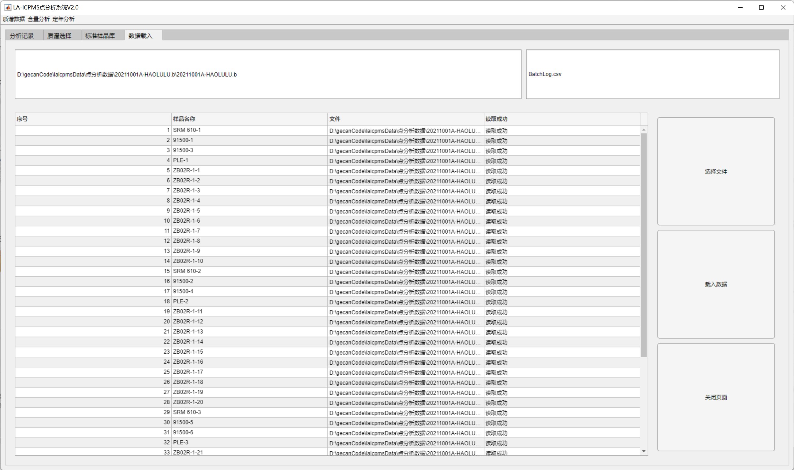

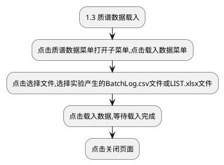
```plantuml
@startuml
:1.3 质谱数据载入;
:点击质谱数据菜单打开子菜单,点击载入数据菜单;
:点击选择文件,选择实验产生的BatchLog.csv文件或LIST.xlsx文件;
:点击载入数据,等待载入完成;
:点击关闭页面;
@enduml
```

------------

### 1.4 样品匹配页面

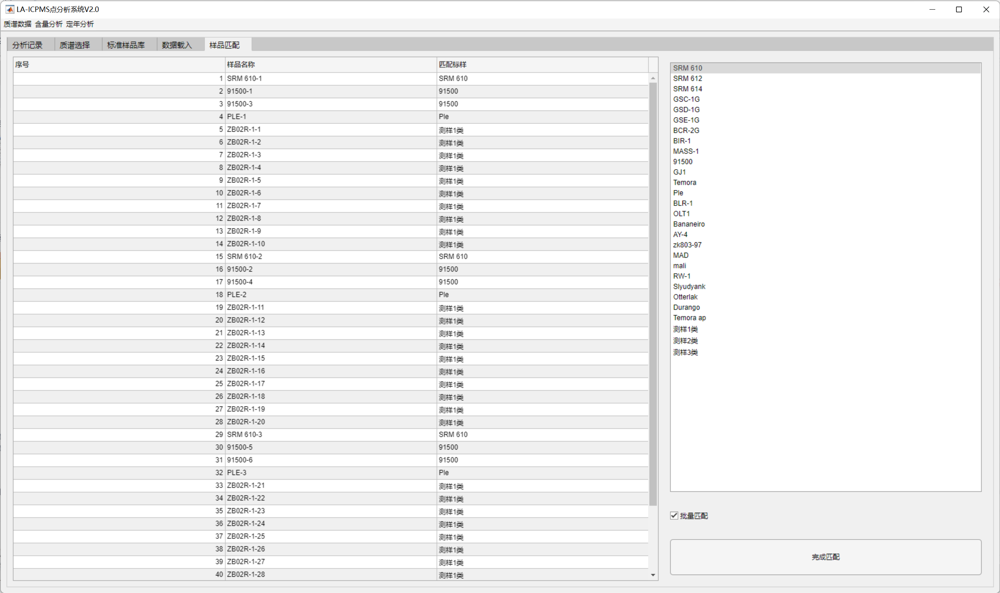

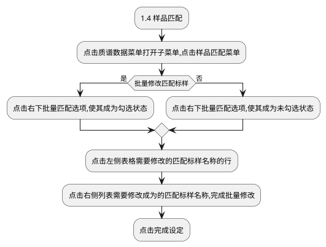
```plantuml
@startuml
:1.4 样品匹配;
:点击质谱数据菜单打开子菜单,点击样品匹配菜单;
if (批量修改匹配标样) then (是)
:点击右下批量匹配选项,使其成为勾选状态;
else (否)
:点击右下批量匹配选项,使其成为未勾选状态;
endif
:点击左侧表格需要修改的匹配标样名称的行;
:点击右侧列表需要修改成为的匹配标样名称,完成批量修改;
:点击完成设定;
@enduml
```

**主要功能：**

- 1）左侧表格列出了读取的质谱数据的样品列表和自动匹配的标样名称，未能自动识别的样品统一标注为测样1类
- 2）右侧列表列出了标样库中的样品名称，另外增加了测样1类到3类，如果测样是分成几种类别，如需要分类绘制定年谐和或反谐和图等等，可以在这里进行区分
- 3）需要修改哪个未能识别的样品，只需点击该样品第3列单元格，再点击右侧列表中正确的名称即可完成批量修改
- 4）如果只想修改一个样品，请把右侧表单下方的批量匹配选项去除

!>由于测样的命名并不规范，因此无法实现完全自动匹配，因此增加了该页面进行直观便捷的匹配

------------

### 1.5 预览与异常剔除页面

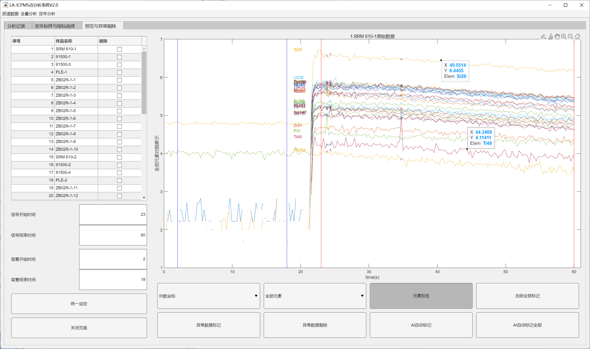

主要功能：
- 1）设定信号开始结束，背景开始结束时间
- 2）点击左侧列表预览数据
- 3）绘图选择可以选择对数坐标或线性坐标，可选全部元素或某种已测元素，以及U-Pb，Pb-Pb，Pb-Th比值，鼠标移动到数据上悬停，将显示元素名称和数据，也可以激活元素标签按钮，将在数据中间显示各个元素名称(高度为该元素最大值)
- 4）异常数据手动标记：点击异常数据标记按钮，鼠标变成十字后，框选异常数据点，如果有多段数据需要框选，可以先框选一段数据，然后按Shift键继续框选另一段数据。框选完毕后，点击异常数据剔除，会剔除该测样与框选数据同时段的所有元素的测量数据。

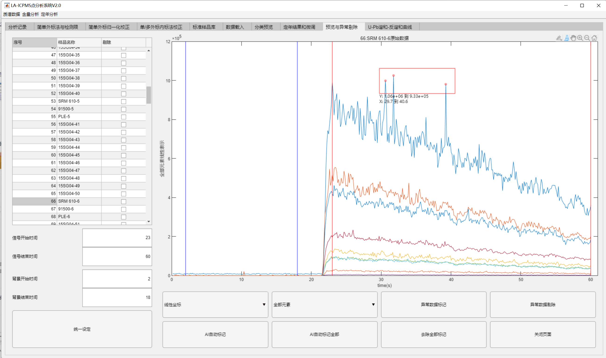

!>剔除后数据显示为`x`

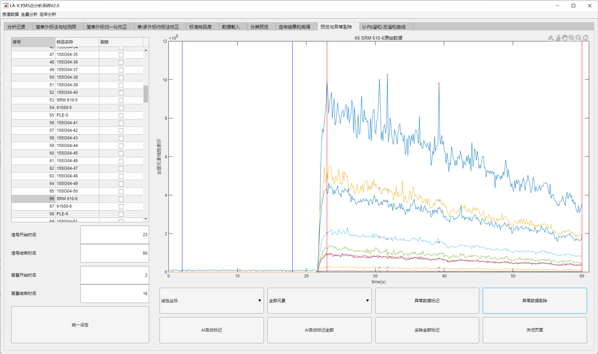

- 5）AI自动标记异常数据：在数据段，会使用13点移动窗检测移动窗内大于3倍标准差的数据；所有剔除工作对各个元素测量值分别进行，然后汇总全部异常点。
- 6）遇到实验明显有问题的样品数据，可以在左侧表格中剔除该样品（如果标样发生问题，一定要剔除，否则会影响周围的测样校正值）

------------

### 1.6 分类预览页面

?>可以选择不同分类的样品，观察数据，均值，标准差，标准误的变化，以了解实验中不同样品的基体分馏、深度分馏效应的影响

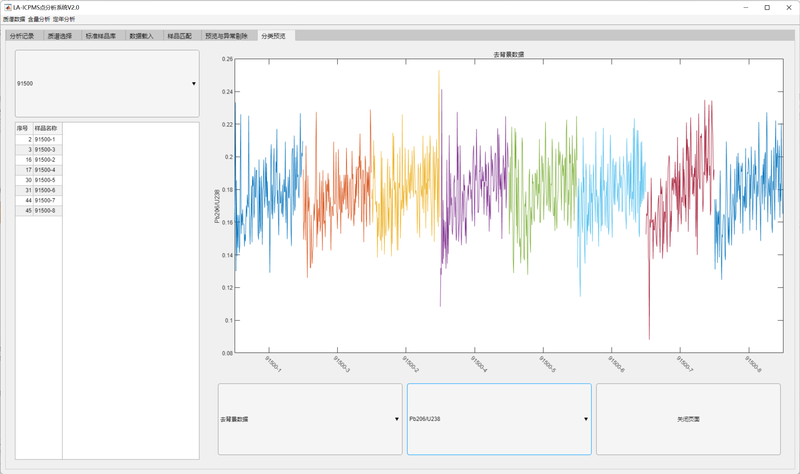

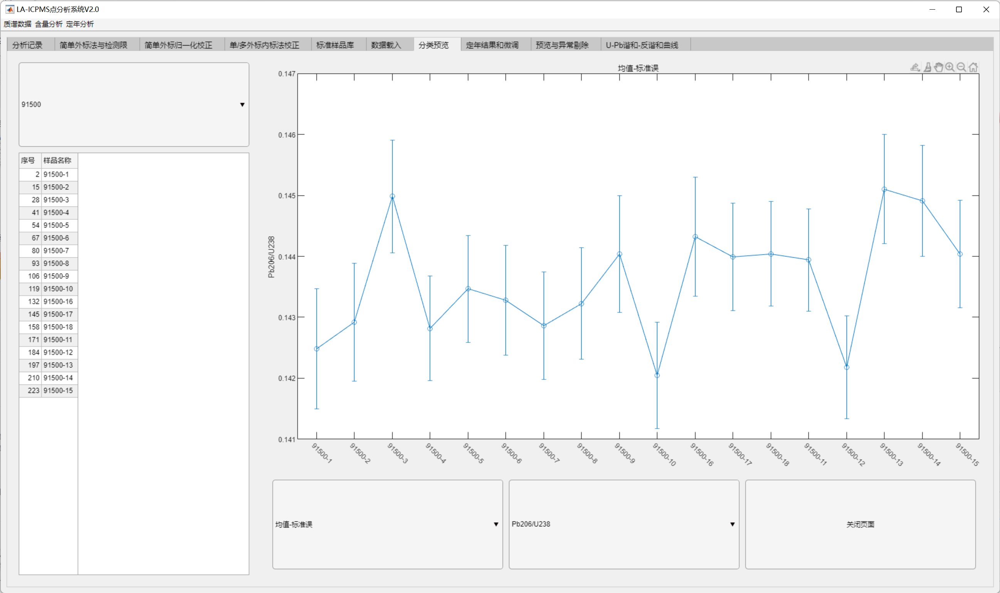

- 例如：发现标样测量的U-Pb比值快速波动和漂移，可能是仪器状态出现了问题，气压不稳定或其他原因，这时的数据是无法通过数据处理获得合理结果的，需要重新做实验。

------------

### 2.1 含量标样分组页面

因为LA-ICPMS仪器的状态变化迅速，姑且认为在较短时间范围内，仪器状态是一致的，因此含量分析是分段进行校正的。
- 打开含量分析菜单，点击含量标样分组菜单
- 打开后会自动进行智能选择，将数据根据标样分成若干段

下图中，数据自动分成的三段：
- 左侧表格中列出了每个样品对应的段号，右图每行代表一个样品（白色五角星,名字列在y轴）分组分段校正使用的标准样品（彩色方块）名称（名字列在x轴），方块颜色代表样品分类
- 如ZB02R-1-3使用了SRM 610-1，91500-1，91500-3，PLE-1，SRM 610-2，91500-2，91500-4，PLE-2这8个标样进行含量校正
- 如对自动分组不满意，可以人工选择或去除某类样品，或者点击表格勾选或去除某个标样，程序将自动重新计算分组分段的段号和绘制含量校正矩阵图

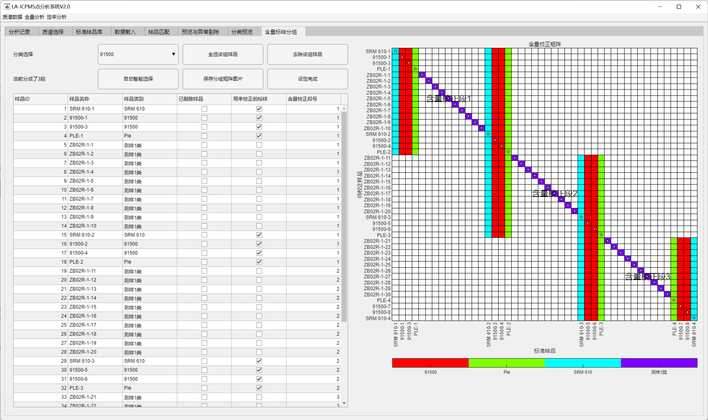

------------

### 2.2 简单外标法与检测限页面

?>打开含量分析菜单，点击简单外标法与检测限菜单

**主要功能**

- 1）利用多种外标计算各个元素ppm-cps的工作曲线，显示各段工作曲线信息和图片
- 2）当选择两种及以上不同种类的外标时，除了斜率，截距外，还将计算相关系数(由于目前用不上不过零点的工作曲线，所以所有拟合均是过0点的，截距为0)。
- 3）中间的表格会对所有分段所有元素的相关系数进行排序，以便方便的找到相关系数较低的工作曲线，点击表格中的单元，将快速跳转并显示到该分段和该元素的统计数据和工作曲线图片
- 4）可以手动修改参与校正的外标，重新计算工作曲线，当段内批量选择按钮被按下时，将同步修改某分段中所有元素的工作标样。
- 5）可以利用AI自动分析各个外标排列组合，分别计算工作曲线，自动挑选相关系数大于0.9中，利用外标个数最多的外标组合；如果相关系数没有大于0.9的，则选择相关系数最高的外标排列组合；如果某段某元素使用单外标，相关系数为Nan，则不进行AI智能排列组合选择。
- 6）根据工作曲线计算各个样品，各个元素背景段数据的平均cps，并利用工作曲线转换为ppm值，统计每种元素ppm值的均值+3倍标准差获得检测限，并在右侧显示

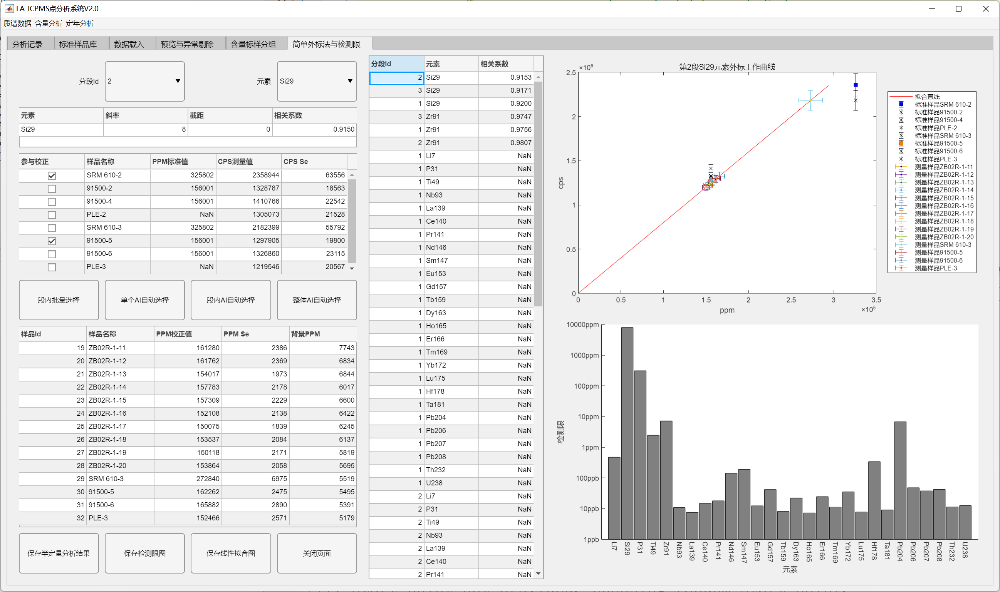

------------

### 2.3 简单外标归一化校正页面

?>当使用者清楚所测是何种物质，且测样的主量元素均测量时，可以使用该页面对数据进行归一化

**主要功能**

- 1）对测样进行归一化元素校正
- 2）程序会自动选择归一化元素，剔除其中的重复性元素，如果对自动选择的归一化元素不满意，则可以人工按住Shift键选择，在计算时，当检测到人工选择了重复元素，将重新返回程序自动选择的归一化元素。
- 3）选择校正方法，由于LA-ICP-MS无法测量或测不准氧、氢、碳、磷、硫、氟等元素，因此在归一化之前需要估算补齐这些元素占比，如配氧法将所选元素配成氧化物后进行归一化，配碳酸法将所选元素配成碳酸盐后进行归一化。

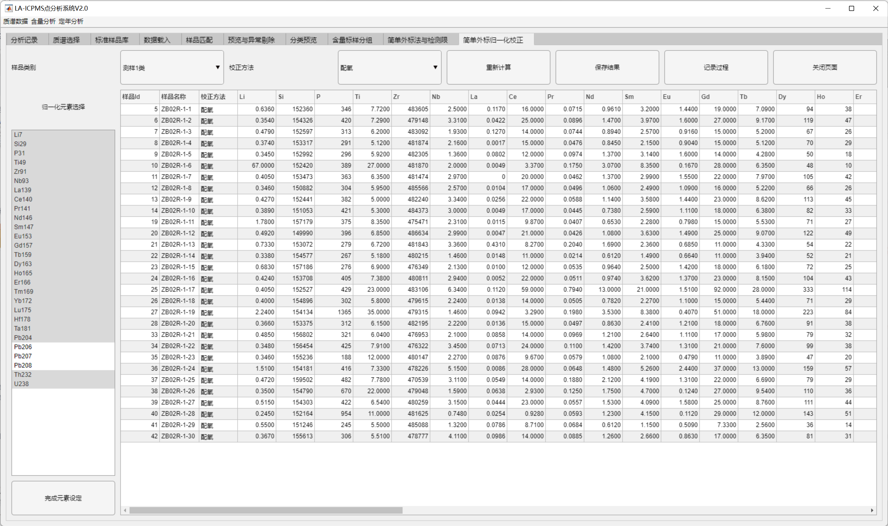

------------

### 2.4 单/多外标内标法校正页面

?>当测样中有一种元素含量稳定且含量已知时，可以将该元素当成内标元素，由于LA-ICPMS测量比值比测量绝对值要准确，因此利用其他元素与内标元素的比值进行校正可以获得更加准确的结果

**主要功能**

- 1）打开页面后，程序将自动分析测样中哪种元素为含量最多的主量元素，并提取其平均含量(简单外标法)，自动选择该元素作为内标元素，并设置内标元素含量。之后进行智能匹配，在左侧内标含量推荐表格中，寻找该元素对应的内标含量推荐值，如果推荐值与简单外标法计算的含量值误差在20%以内，则替换为推荐值。
- 2）之后，程序自动智能从多种外标中挑选最合适做校正的外标，形成右侧表格。合适的依据是计算测样的内标元素cps的数据量级与该分段中所有外标对应元素的cps的数量级之差的绝对值作为内标元素距离，距离越小说明该标样与测样的内标元素越相近。同时计算测样的各个待校正元素cps的数据量级与该分段中所有外标对应元素的cps的数量级之差的绝对值作为待校正元素距离。当内标元素距离与待校正元素距离之和最小的外标即使最合适外标，因为，测样的内标和待校正元素与外标均十分相近。
- 3）根据内标元素含量和校正表格，分别计算测样各个元素的校正含量，显示在下侧表格中。
- 4）如果使用者想使用其他内标元素，可以手动修改元素和含量，或者在左侧推荐表格中点击选取元素及推荐值，如果对自动推荐的合适外标不满意，可以使用下拉菜单选择好外标后，点击右侧表格中的单元格进行手动修改，修改后点击重新计算按钮即可。

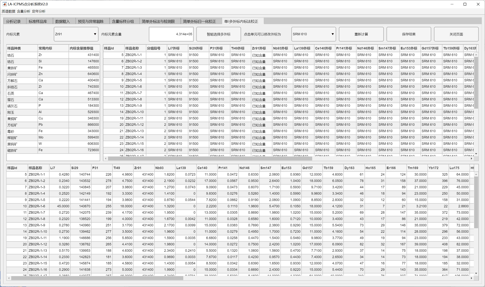

------------

### 3.1 定年标样与指标选择页面

?>该页面是执行定年的必选页面，选择了定年的标样和定年指标(Pb208_U238,Pb207_U235,U238_Pb208,Pb207_Pb206,Pb208_Th232)之后才能进行后续定年计算

**主要功能**

- 1）选择定年标样，如果还有其他定年标样，则自动设为检验标样，如定年标样选择了91500，检测到还测量了PLE，则利用91500计算各个指标，并分段计算分馏系数，利用分段分馏系数校正PLE检验标样。
- 2）定年指标选择后会影响定年结果和微调页面计算指标和图片显示。
- 3）如果发现定年标样列表中有的年龄标样测量值有异常，或者校正不了检验标样，可以在左侧中部列表中选择剔除，按住Shift键可以多选。
- 4）选择不同的定年标样可以实现标样和检测标样互换
- 5）点击检验标样年龄按钮，会将右侧检验标样绘图的y轴修改为检验标样年龄，检验标样绘图中的红色线分别是真值，真值±10%，真值±20%的参考线

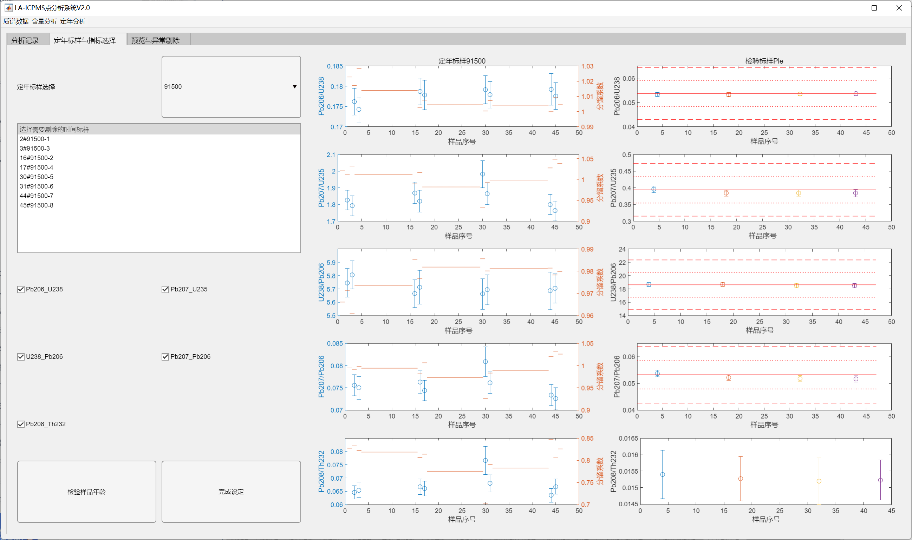

------------

### 3.2 定年分析和微调

**主要功能**

- 1）打开页面后，会根据上个页面中选择的标样和定年指标自动分析计算定年结果。计算方法有两种：

> ◉ 固定积分区间法： 标样和测样都按照自己选择的固定区间（剔除异常值后）计算分馏系数和指标比值(U-Pb,Th-Pb)，分段计算分馏系数的均值对各个测样指标比值进行校正
> ◉ 联动积分区间法：根据每个测样和本段标样共同剔除异常值后的积分区间的交集区间来计算分馏系数，并对测样进行校正
> ◉ 联动积分区间法的使用场景：在测量过程中，每个点的数据有严重的深度分馏(指标比值随着时间变化)，但是前提是深度分馏模式对所有样品都一样，采用联动积分区间可以消除深度分馏效应，缺点是会减少数据量，增加标准误。联动积分区间法的使用场景：在测量过程中，每个点的数据有严重的深度分馏(指标比值随着时间变化)，但是前提是深度分馏模式对所有样品都一样，采用联动积分区间可以消除深度分馏效应，缺点是会减少数据量，增加标准误。

- 2）如果同时测量了Pb206_U238年龄和Pb207_U235年龄，会额外计算谐和度(Concordant=75Age/68Age）指标，不含普通铅的样品，谐和度应该接近1。
- 3）如果对数据谐和度偏离1有可能是含有普通铅，或者剥蚀时打穿样品或打到包裹体导致，需要人工剔除异常数据。可以点击谐和度调节按钮打开【U-Pb谐和度调整】页面进行人工调节和AI智能调节（也可以从菜单打开）。
- 4）点击右侧上方表格单元可以在右下实时显示各个样品的数据
- 5）左下是全体数据年龄的统一显示
- 6）保存定年结果

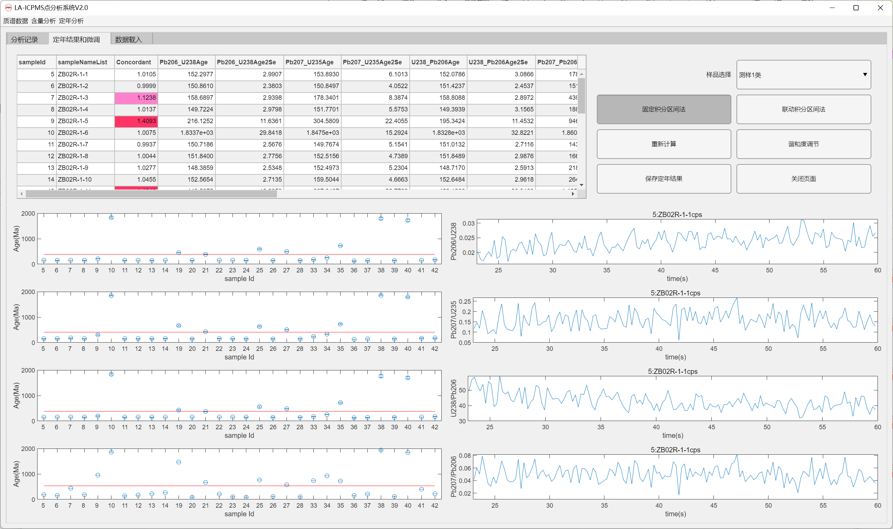

------------

### 3.3 U-Pb谐和度调整

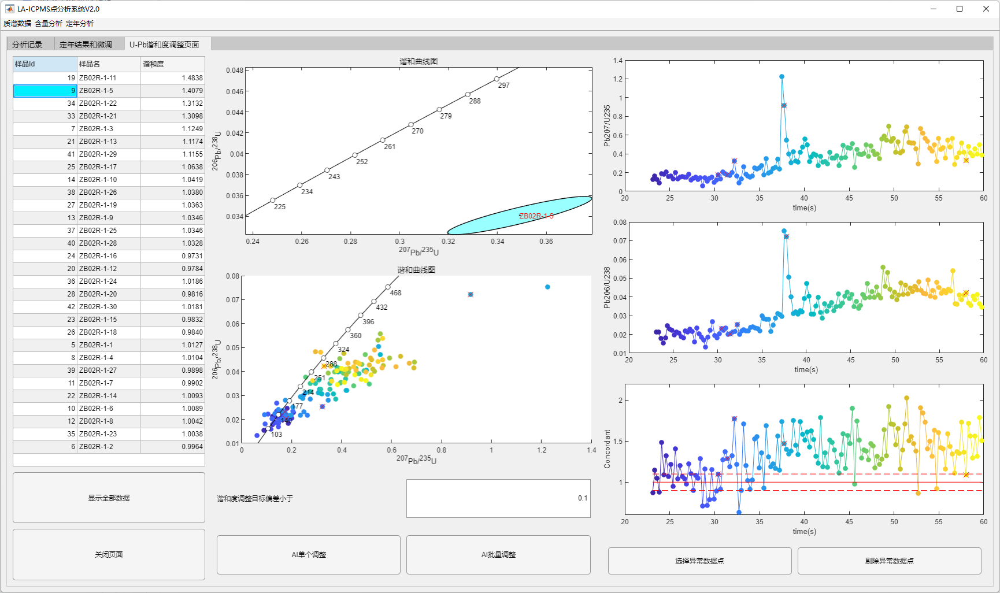

?>提供各种各种指标可视化，方便进行谐和度调整

!>注意：在本页面调节后需要重新打开3.2 定年分析与微调页面导出结果
!>注意：不建议使用AI批量调整，虽然很便捷但是可能会剔除掉大量数据，建议人工结合AI单个调整逐个剔除异常数据

**主要功能**

- 1）左侧提供谐和度排序表，偏离越大的排在前面，点击其中的单元，可以显示该样品的各个指标
- 2）中部上图显示了该样品的在谐和曲线图中的误差椭圆，当【显示全部数据】按钮被按下时，将显示所有样品的误差椭圆，方便查看与其他样品的关系
- 3）中部下图显示了单个点分析中不同时间的Pb-U比值散点图，颜色从蓝到黄色代表不同时间，可以方便的看出哪些时段的数据是谐和的，方便定位包裹体和打穿样品产生的偏离谐和曲线的数据位置
- 4）右侧上中两图是测量数据，颜色意义同上
- 5）右侧下方是各个测量数据点的谐和度，红色实线代表谐和度为1的参考线，红色虚线代表0.9和1.1的参考线
- 6）可以手动选择剔除异常数据，按【选择异常数据点】按钮进入数据选择状态，鼠标变成十字框选右侧3图或中间下图中的数据点，如果想选择不同区域可以按住SHIFT多次框选。选择完毕后点击【剔除异常数据点】即可完成剔除，数据点绘图中剔除的数据会标记上X

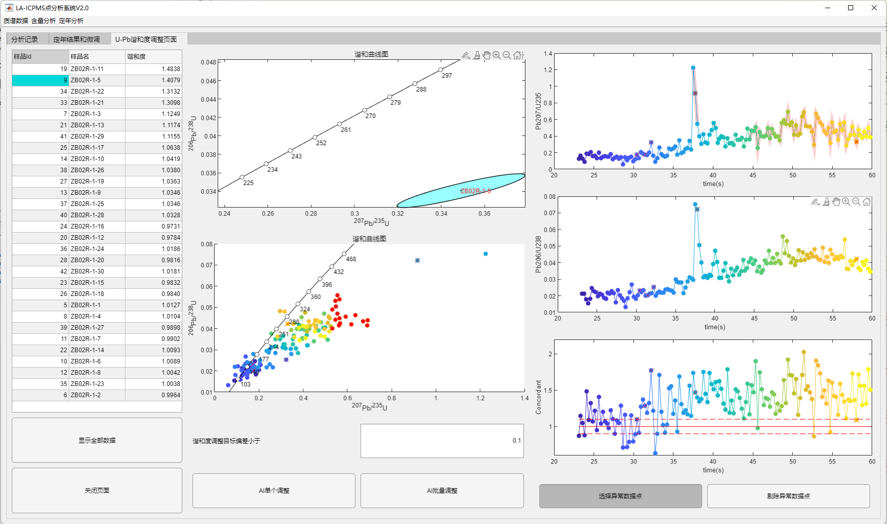

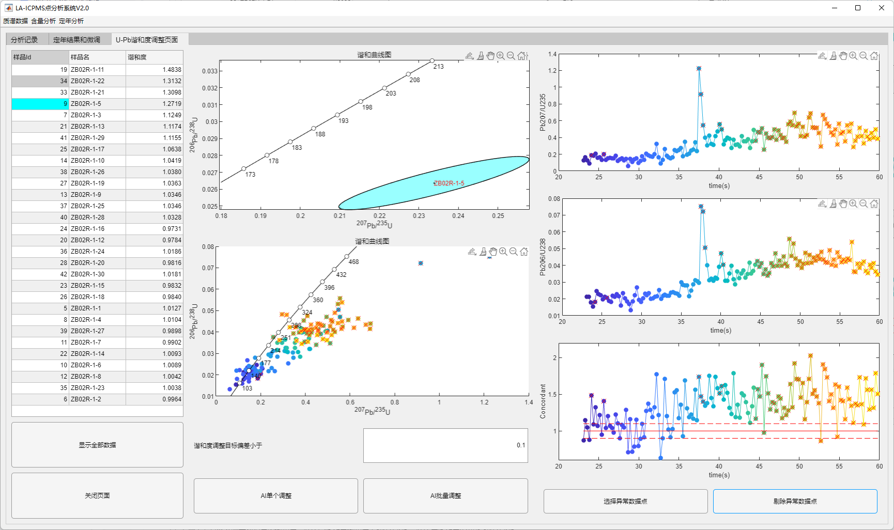

- 7）也可以设定【谐和度调整目标偏差】阈值上限，点击AI单个调整，自动剔除一个点分析的异常数据或AI批量调整，调节所有点分析的异常数据。PS偏差阈值只对固定积分区间法有效，联动积分区间法只能大致估计，调整后和谐度偏差不一定能低于阈值。

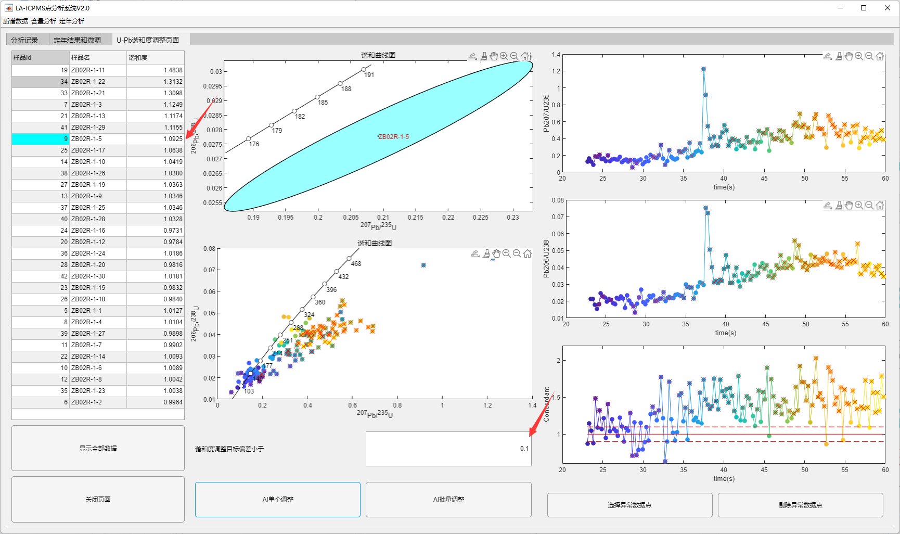

------------

### 3.4 U-Pb谐和-反谐和曲线页面

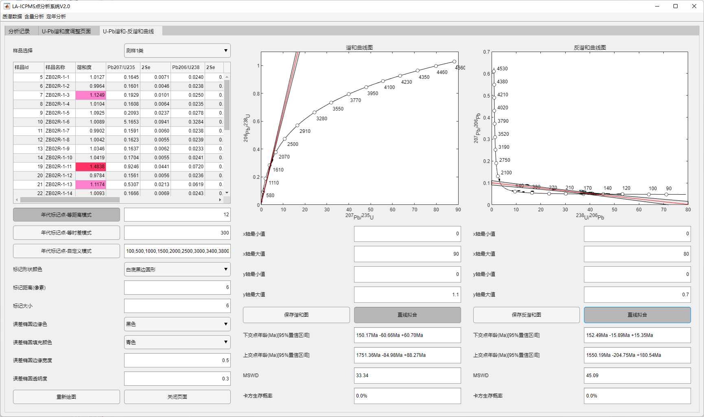

**主要功能**

?>提供绘制U-Pb谐和或反谐和曲线的要求的用户或者测样含普通铅需要进行线性回归的用户可以使用本页面实现其功能

- 1）左侧表格中列出了某类数据，可以通过样品选择下拉菜单切换。点击表格不同位置有不同响应：①点击样品id对应的单元格，对应单元格会标绿，对应图中会显示该样品的id号，点击样品id的列名称，将全选该列，所有样品都将标注Id号；②点击样品名称对应的单元格，对应单元格会标红，对应图中会删除该样品误差椭圆，直线拟合也将重新计算；③选择其他单元格后再次点击标红或标绿的单元格，可以取消标记。
- 2）中部和右侧分别显示了谐和曲线和反谐和曲线图(如果没有选择计算对应的指标，则可能只出现谐和曲线或反谐和曲线)。表格下方给出了绘制曲线中的各种绘图选项，用户可以进行选择并重新绘图。图片下方给出了绘图的范围，用户可以自行定义。
- 3）直线拟合按钮被激活后，将自动进行直线拟合并给出上下交点，MSWD和卡方生存概率，并在图中标注

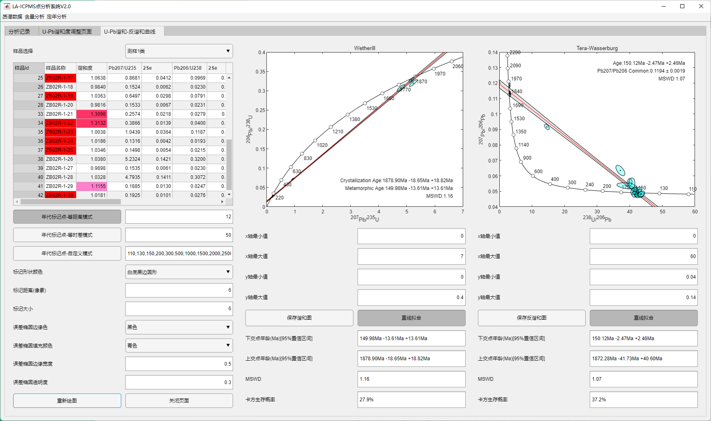
