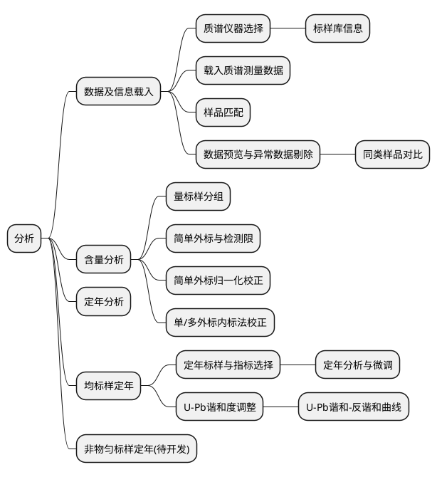
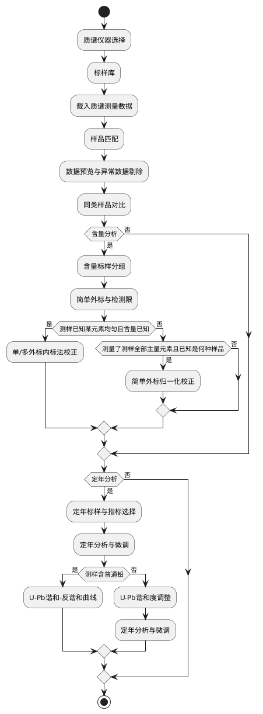

# SpotAnalysis 功能介绍

!>使用简介：https://note.youdao.com/s/ASHbY4Ya

## 软件菜单

### 菜单列表

### 页面的前后流程与关系

## 软件页面

### 0. 启动页面

### 1.1质谱仪器选择页面

### 1.2 标准样品库页面

### 1.3 载入数据页面

### 1.4 样品匹配页面

### 1.5 预览与异常剔除页面

### 1.6 分类预览页面

### 2.1 含量标样分组页面

### 2.2 简单外标法与检测限页面

### 2.3 简单外标归一化校正页面

### 2.4 单/多外标内标法校正页面

### 3.1 定年标样与指标选择页面

### 3.2 定年分析和微调

### 3.3 U-Pb谐和度调整

### 3.4  U-Pb 谐和-反谐和曲线页面
