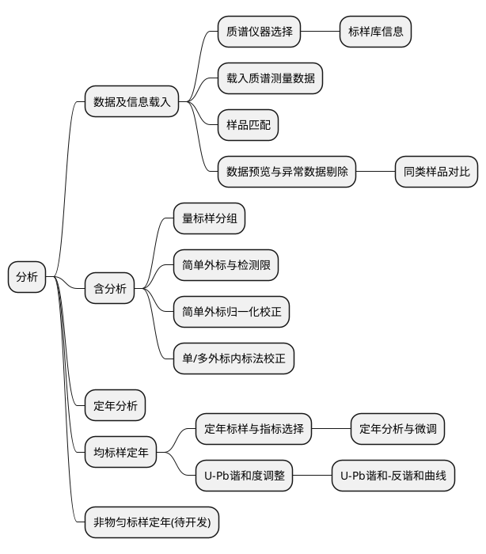

# 简易使用教程

!>以下内容基于

## 软件菜单

## 微量元素分析
0.启动页面
1.1 质谱仪器选择页面
1.2 标准样品库页面
1.3 载入数据页面
1.4 样品匹配页面
1.5 预览与异常剔除页面
1.6 分类预览页面
2.1 含量标样分组页面
2.2 简单外标法与检测限页面
2.3 简单外标归-化校正页面
2.4 单/多外标内标法校正页面

## 定年分析
3.1 定年标样与指标选择页面
3.2 定年分析和微调
3.3 U-Pb 谐和度调整
3.4 U-Pb 谐和-反谐和曲线页面
